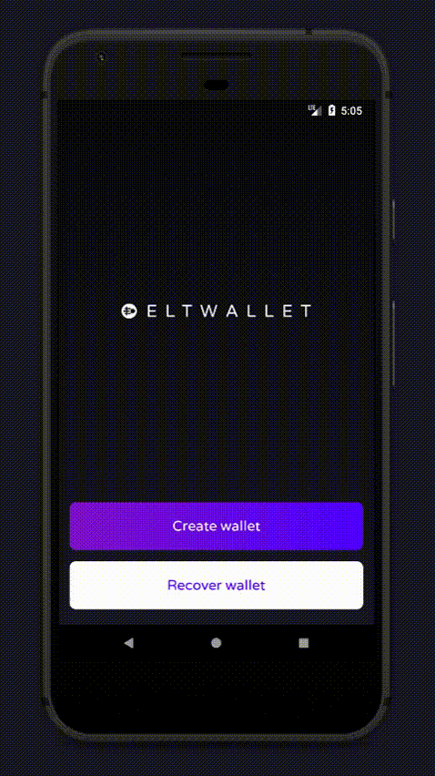

<div align="center">
  <p>
    
  </p>
  <p>
    ✨ Ethereum and ERC20 tokens wallet built by ELTCOIN ✨
  </p>
  <p>
  <a href="https://play.google.com/store/apps/details?id=tech.eltcoin.eltwallet">
    
  </a>
  </p>
</div>

## Features

* 🔩 <strong>Simple: </strong>Bootstrapped with
  [react-native-cli](https://github.com/facebook/react-native)

* 💯 <strong>State of the art: </strong> Wallet generation using
  [react-native-randombytes](https://github.com/mvayngrib/react-native-randombytes)
  using native code

## Demo

<div align="center">
  
</div>

## Local development

Make sure you have `react-native-cli` installed.

```bash
# Install dependencies
$ npm install

# Run project on connected iPhone or iOS simulator
$ react-native run-ios

# Run project on connected Android device or running Android simulator
$ react-native run-android
```

Have fun!
